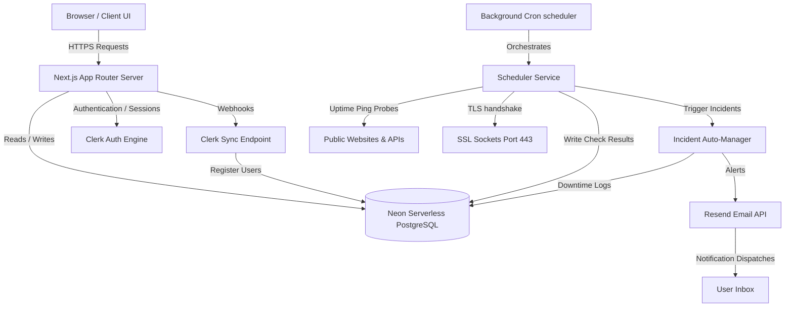

# Sentinel | Website & API Monitoring Platform

Sentinel is a production-grade, high-performance Website & Operations Monitoring SaaS platform designed for modern tech squads. It observes website availability, computes latency timeseries, validates SSL socket certificates, and dispatches automated incident alerts.

---

## Architecture Design



---

## Technology Stack

*   **Framework**: Next.js 16 (App Router with Turbopack)
*   **Language**: TypeScript (Strict Mode)
*   **Database**: Neon Serverless PostgreSQL
*   **ORM**: Prisma 7 (Neon serverless adapter)
*   **Authentication**: Clerk Auth (Proxy middleware & session tracking)
*   **Styling**: Tailwind CSS & shadcn/ui
*   **State Management**: TanStack React Query (React Query)
*   **Form Management**: React Hook Form & Zod Schema Validation
*   **Charts**: Recharts (Latency area analytics)
*   **Email Engine**: Resend API

---

## Folder Structure

```text
sentinel/
├── app/                  # Next.js App Router pages, APIs, and routes
│   ├── (auth)/           # Clerk authentication layouts
│   ├── (dashboard)/      # Protected workspace dashboard
│   ├── (marketing)/      # Bento Grid landing page and layout
│   ├── api/              # API Route Handlers (cron, monitors, health)
│   └── status/           # Dynamic public status pages
├── components/           # Generic pure UI elements (button, dialog, input, etc.)
├── config/               # Settings schemas and environment validations
├── hooks/                # Custom React Query hooks
├── jobs/                 # Cron orchestrators & background worker engines
├── lib/                  # Client instantiations (db connection, logger)
├── prisma/               # Schema specifications, seed data, and configs
├── services/             # Pure business logic services (monitor, audit, analytics)
├── types/                # Domain TypeScript typings
└── utils/                # Utility checkers (ping socket, host extractions)
```

---

## Installation & Setup

### 1. Configure Local Environment
Copy `.env.example` to create `.env.local`:
```bash
cp .env.example .env.local
```
Fill in the configuration parameters inside `.env.local`:
*   `DATABASE_URL` / `DIRECT_URL` (Neon PostgreSQL)
*   `NEXT_PUBLIC_CLERK_PUBLISHABLE_KEY` / `CLERK_SECRET_KEY` (Clerk Auth keys)
*   `CLERK_WEBHOOK_SECRET` (Clerk Webhooks integration)
*   `RESEND_API_KEY` (Resend Email key)

### 2. Install Project Dependencies
Run npm installer to fetch required packages:
```bash
npm install
```

### 3. Initialize Database & Seeds
Push database models and populate the PostgreSQL instance with seed records (monitors, checks, incidents):
```bash
npx prisma db push
npx prisma db seed
```

### 4. Boot Up Local Development Server
Launch Turbopack Next.js server:
```bash
npm run dev
```
Open [http://localhost:3000](http://localhost:3000) to inspect.

---

## API Documentation

### System Diagnostics
*   `GET /api/health` - Check database connection status and server timestamp.

### Monitoring Controls
*   `GET /api/monitors` - Retrieve list of monitors.
*   `POST /api/monitors` - Register a new monitor endpoint.
*   `GET /api/monitors/[id]` - Retrieve detailed monitor configs.
*   `PATCH /api/monitors/[id]` - Update monitor check parameters.
*   `DELETE /api/monitors/[id]` - Delete monitor configuration and history logs.

### Analytics & Incidents
*   `GET /api/monitors/[id]/analytics` - Time-series latency database records.
*   `GET /api/monitors/[id]/checks` - Historical check entries list.
*   `GET /api/monitors/[id]/incidents` - Incident lifecycles history.

---

## Future Roadmap

1. **Multi-Region Check Agents**: Deploy distributed ping runners across global AWS regions (e.g. us-east-1, eu-west-1, ap-southeast-1) to observe regional latency fluctuations.
2. **Slack & MS Teams Integrations**: Dispatch instant incident notifications directly into developer chat instances.
3. **Weekly SLA Reports**: Automated compiling of weekly performance digests delivered to system administrators.
